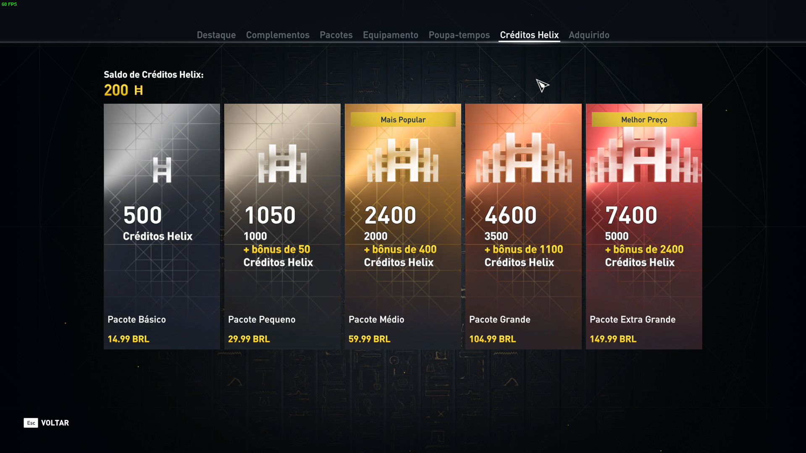
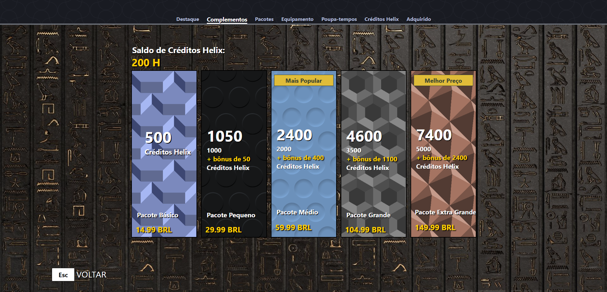

# Projeto Pessoal - Réplica da Loja de Helix 
### Projeto pessoal que realizei com HTML e CSS, replicando o menu de "compra de Helix" do jogo "Assassin's Creed Origins"

### ✨ Tecnologias

O projeto foi desenvolvido com as seguintes tecnologias:

- HTML
- CSS

Este é um projeto que utiliza HTML e CSS, e replica uma das seções de compra do jogo. Eu estava jogando, abri sem querer este menu e pensei "acho que consigo recriar isto". Então, abri o VSCode e comecei a codar. Adorei realizar o projeto pois foi uma forma de treinar e estudar, e foi fazendo ele que mais aprendi ambas as ferramentas. 

Como não possuo as fotos originais e nem a fonte, não iria ficar exatamente igual, porém eu queria ao menos replicar a estrutura, os posicionamentos e os comportamentos de mouse, e fiquei muito satisfeito com meu resultado e desempenho! 

Neste repositório, coloquei uma foto do menu original que foi utilizado de referência, e o meu resultado final.
Também está disponível um vídeo que mostra como o projeto se comporta com as propriedades de "hover", quando passamos o mouse em cima.

## Menu que utilizei como base e inspiração:

## Resultado:
Também disponível para visualizar nos arquivos do repositório, junto com o vídeo para ver o comportamento de hover, com mouse.

## 👷 Colaborador

#### Nome: Guilherme Melo Santos da Silva
- [GitHub](https://github.com/GuiMelo012x)
- [LinkedIn](https://www.linkedin.com/in/guilherme-melo-077732248/)
