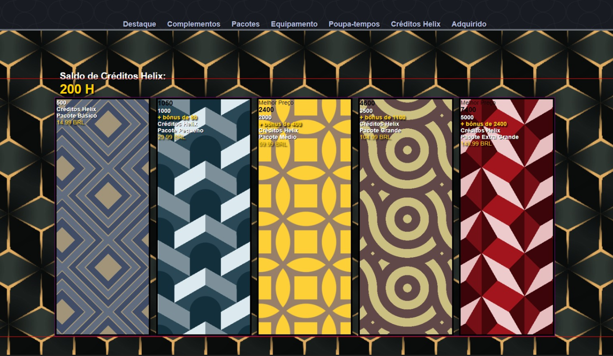
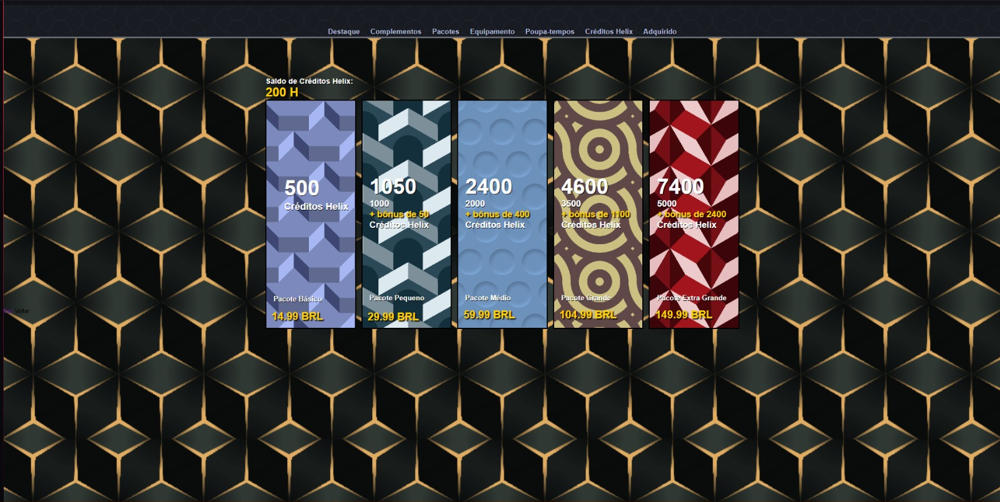

# Versões Antigas
Nesta pasta coloquei fotos de como eram, e como fui alterando os arquivos e algumas versões antigas do projeto. Não tirei muitas, mas consegui pegar essas e achei que seria legal ver como era e como ficou no final!  

Antes de mudar o layout, o fundo, e estilizar:
Uma coisa que me ajudou muito a desenvovler este projeto, foi colocar bordas em todas as divs e seções, para saber aonde exatamente estou mexendo, pra que lado, a largura, etc.

Perto do final, resolvi mudar alguns banners pois estavam com uma cor que dificultava ver os valores e o texto, então procurei outros templates mais escuros.
Tambem resolvi mudar o fundo para a foto original, porém sem os efeitos de vídeo (esfumaçamento, sombreamento) que o jogo possui. Achei que ficava muita informação com este tanto de quadrados.

